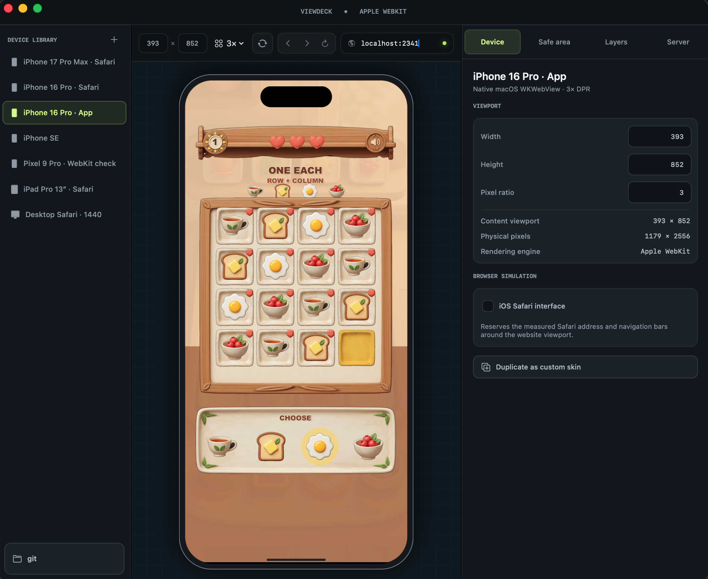

# ViewDeck

ViewDeck is a native macOS studio for previewing websites and local web projects inside configurable device frames. Its renderer is `WKWebView`, so previews use Apple WebKit directly.



> [!NOTE]
> ViewDeck reproduces viewport geometry, device pixel ratio, safe areas, and optional browser chrome. It is not an iOS or Android operating-system emulator.

## Features

- Native AppKit interface with Apple WebKit rendering.
- Built-in iPhone 17 Pro Max and iPhone 16 Pro browser/app profiles, plus iPad, Android-sized, and desktop profiles.
- Phone and tablet profiles expose touch-style input capabilities to page JavaScript and CSS, including coarse-pointer and no-hover media queries.
- Custom device setups that retain every editable Device-panel value, including safe-area behavior, orientation, and layer selections.
- Safe-area visualization, CSS variables, and optional page-padding injection.
- Optional reusable HTML header, footer, and landscape-only side rail layers.
- WebGL and WebGPU content through `WKWebView` when supported by the host Mac.
- One-click access to the full WebKit Inspector without opening Safari.
- Links that request a new tab or window stay in the current preview; non-web URL schemes are handed to macOS.
- Local preview modes for an npm script, a static HTML file, or a custom command.
- Automatic localhost URL detection, port-conflict rerouting, in-app process output, and stop controls.
- Live localhost port inventory with process, command, working-directory, collision, open, and stop controls.
- Deterministic per-preview network shaping for round-trip latency, jitter, upload/download bandwidth, and offline behavior.
- Resizable side panels and a compact, responsive workspace.
- One-click screen-only device screenshots with editable, resizable text boxes that keep wrapped text visible, restylable drawings and arrows, and tightly cropped clipboard or PNG exports on the dark canvas background.
- A machine-readable CLI for deterministic screenshots, MP4 recordings, page diagnostics, safe-area audits, and managed local-server runs.
- Record and replay portable QA scenarios containing timed pointer, mouse, form, and keyboard input, critical-moment screenshots, MP4 video, and the complete device configuration.

## Requirements

- macOS 14 or newer.
- Xcode Command Line Tools with Swift 6 or newer.
- Node.js and npm only when previewing npm-based projects or running the npm integration tests.

ViewDeck is currently distributed as source. The build script creates an ad-hoc signed application for local development.

## Build and run

```bash
git clone https://github.com/LorenzGit/view-deck.git
cd view-deck
zsh scripts/build-native-app.sh
open dist/native/ViewDeck.app
```

The application is assembled at `dist/native/ViewDeck.app`. For a quicker development run without assembling an application bundle:

```bash
swift run --package-path native ViewDeckNative
```

The build also creates `dist/native/viewdeck`, a standalone command-line executable.

## Command-line automation

CLI previews are hidden by default. ViewDeck keeps an ordered WebKit panel
outside the bounds of every connected display so pages can render, receive
replayed input, and produce screenshots or video without showing a mini device
window to the user. Hidden previews disable WebKit's window-occlusion throttling
so `requestAnimationFrame`, WebGPU queue work, and media timelines remain active.
Screenshots and video frames come from the preview window's compositor surface,
which preserves GPU-backed canvas content. Pass `--show-preview` when visually
debugging a CLI run. Machine-readable reports expose the selected visibility,
capture backend, offscreen-rendering state, and whether the preview window
intersects a display.

For an offscreen run that may play sound, pass `--audio verify-silent`.
ViewDeck mutes the WebKit page output without pausing its media timeline, then
reports timestamped native audio activity together with HTML media errors,
media events, and Web Audio source starts. This mode is intentionally rejected
when `--show-preview` is enabled.

List the available device profiles:

```bash
dist/native/viewdeck devices list --json
```

Start a project's development server, wait for its canvas, take a device screenshot, and write a JSON audit:

```bash
dist/native/viewdeck capture \
  --project /path/to/project \
  --npm-script dev \
  --device iphone-17-pro-max \
  --wait-for canvas \
  --audio verify-silent \
  --output /tmp/game.png \
  --report /tmp/game.json
```

Record an MP4 using the same composited WKWebView output:

```bash
dist/native/viewdeck record \
  --project /path/to/project \
  --npm-script dev \
  --wait-for canvas \
  --duration 6 \
  --fps 12 \
  --output /tmp/game.mp4 \
  --screenshot /tmp/game-final.png \
  --report /tmp/game.json
```

`capture`, `inspect`, and `record` accept an HTTP URL, a local HTML file, or a managed project command. Readiness can be tied to page load, a CSS selector, or a JavaScript expression. `--prepare-js` can establish a deterministic page state after readiness and before artifacts are captured. Reports include the final URL and title, device geometry, safe-area values, console messages, uncaught page errors, canvas dimensions, horizontal overflow, offscreen interactive elements, and interactive safe-area overlaps.

Apply repeatable network conditions with explicit values:

```bash
dist/native/viewdeck inspect https://example.com \
  --network-rtt-ms 400 \
  --network-jitter-ms 40 \
  --network-down-kbps 1500 \
  --network-up-kbps 500 \
  --network-seed 42 \
  --report /tmp/network.json \
  --json
```

Any network option enables shaping. Use `--network-enable` for the defaults, `--network-offline` to block connections, and a bandwidth value of `0` for unlimited throughput. ViewDeck routes remote TCP traffic through a loopback SOCKSv5 proxy and local HTTP traffic through a loopback TCP bridge, splits RTT across both directions, and uses the seed to make jitter repeatable. Reports identify the effective transport, whether shaped traffic was actually observed, connection and byte counters, and `network.activity.resources` with each document, script, style, image, font, media, and fetch/XHR lifecycle. Increase `--timeout` when deliberately testing long delays or low bandwidth.

Use `--json` for machine-readable stdout, `--fail-on-page-error` or `--fail-on-issues` for CI policies, and `viewdeck help` for the complete option list. JSON mode keeps ViewDeck's own result on stdout and writes development-server output to stderr.

### Test scenarios

The **Test Tools** card separates one-off capture from repeatable test scenarios. Under **Capture**, **Markup** captures the current device and opens the markup editor, while **Record video** starts a standalone 30 FPS MP4 recording that runs until you click **Stop video**.

Under **Test scenarios**, click **Record test**, choose a `.viewdeck.json` destination, optionally enable **Include an MP4 with this test recording**, and interact with the page normally. ViewDeck first clears site-scoped WebKit data and client storage, then reloads the page before timing begins so first-run experiences, tutorials, and cache-backed state start cleanly. It records pointer down/move/up, mouse clicks and drags, keyboard down/up (including code, modifiers, location, composition, and repeat), and form changes. Every event contains both its timestamp from the start of the run and the interval since the previous event. A derived `gestures` section classifies clicks/taps, drags, swipes, direction, distance, duration, sampled points, source event IDs, and the interval since the previous gesture.

While recording, **Replay test** becomes **Add checkpoint**. Click it to save a timestamped checkpoint PNG beside the scenario, then click **Stop & save** to write:

- The editable, versioned `.viewdeck.json` scenario.
- A complete MP4 when **Include an MP4 with this test recording** was selected.
- A timestamped PNG for every checkpoint.

The scenario embeds the exact device profile and custom geometry, portrait and oriented viewport sizes, CSS and physical-pixel resolutions, DPR, shell and sensor geometry, configured/oriented/page safe areas, safe-area guide and layout mode, Safari simulation and chrome dimensions, user agent, home indicator, network-shaping configuration, and enabled header/footer/side-layer metadata and HTML. It also records the URL/project launch configuration and detailed browser, navigator, screen, visual viewport, document, graphics, preference, storage-key, locale, and timing snapshots.

Click **Replay test** to choose a scenario, timing speed, and whether to capture replay artifacts. During playback the control becomes **Stop replay**; stopping cancels all pending inputs, finishes the partial video, and writes a cancelled replay report. ViewDeck restores the recorded configuration, clears the recorded site's cache, cookies, local/session storage, Cache API entries, service workers, and IndexedDB, and only then loads the source and begins playback. Coordinates are stored both absolutely and normalized, which makes canvas interactions suitable for PixiJS and Three.js while DOM selector hints improve React and HTML replay.

Live video capture uses the macOS window compositor at 30 FPS rather than repeatedly requesting synchronous WKWebView snapshots, including for hidden CLI runs. Capture and H.264 encoding run away from the main UI thread at a video-appropriate resolution. If the machine cannot produce a frame on time, ViewDeck skips that slot instead of issuing a burst of catch-up captures that would compete with the tested page. Explicit screenshots and checkpoints use the same GPU-compatible compositor path.

AI agents can generate a complete, valid scenario skeleton without hand-authoring the device configuration:

The repository includes a reusable [`viewdeck-qa`](.agents/skills/viewdeck-qa/SKILL.md) agent skill. Direct an agent with a prompt such as `Use $viewdeck-qa to test this game on iPhone 17 Pro Max and return the scenario, screenshots, video, and report.` The skill covers one-state audits, AI-authored and recorded scenarios, PixiJS/Three.js canvas input, React/DOM input, keyboard-only games, semantic waits, smart replay, and artifact review.

```bash
dist/native/viewdeck qa template http://localhost:5173 \
  --device iphone-17-pro-max \
  --name "keyboard smoke test" \
  --output /tmp/gameplay.viewdeck.json
```

The generated JSON includes the selected device, resolution, DPR, safe areas, Safari state, page-layer state, source configuration, authoring rules, and copyable pointer, keyboard, selector-wait, JavaScript-wait, and fixed-delay examples. Its top-level `events` array is intentionally empty for an agent to populate.

The same replay is available to scripts and AI agents. `--speed smart` preserves short gaps, pointer/mouse down-to-up gestures, and keyboard holds while capping long idle gaps at 250ms:

```bash
dist/native/viewdeck qa replay /tmp/gameplay.viewdeck.json \
  --speed smart \
  --audio verify-silent \
  --artifacts /tmp/qa-checkpoints \
  --video /tmp/qa-replay.mp4 \
  --screenshot /tmp/qa-final.png \
  --report /tmp/qa-replay.json \
  --json
```

Use `--speed 0.5`, `1`, `2`, `4`, `smart`, or `max`. Smart replay writes a `timingPlan` containing every event’s original timestamp, effective timestamp, intervals, and adjustment reason, along with the total time saved. This keeps the source JSON auditable instead of rewriting its recorded timing.

For readiness that genuinely matters, add a `wait` event with a CSS `selector`, a `javascript` condition, a fixed `delayMilliseconds`, or a combination. Selector and JavaScript waits support `timeoutMilliseconds` and `pollIntervalMilliseconds`; they execute semantically even when surrounding idle gaps are compressed. A replay report also contains the restored configuration, actual playback timing, page audit, console/page failures, server output, event errors, and all artifact paths.

## Preview a project

1. Choose a device profile in the left sidebar.
2. Enter a URL in the toolbar and press Return, or choose a local project folder.
3. To debug the loaded page without opening Safari, click the wrench button in the preview toolbar to open Web Inspector.
4. Open the **Server** inspector and select a launch mode:
   - **NPM script** discovers scripts in `package.json` and runs the selected script.
   - **Static HTML file** loads an HTML file with read access to neighboring assets.
   - **Custom command** runs a command in the selected project folder.
5. Use **Stop process** to terminate the process and its child processes. While a managed process is active, the same red stop control appears in the preview toolbar; stopping it returns the device to the empty **Native WebKit preview** screen.

Use the leading-sidebar button in the preview toolbar—or press Control-Command-S—to collapse or restore the entire Device Library panel. ViewDeck remembers both its visibility and its last expanded width.

ViewDeck reads the exact local URL printed by tools such as Vite, including the selected port. It does not assume that a project uses port 5173.

Before ViewDeck launches a recognized development server, it records the ports that are already occupied. If the new server still announces one of those ports—for example, because two processes bound the same port on different loopback addresses—ViewDeck stops only the process it just launched and retries it on the next free port. This automatic retry supports common `--port`-aware commands such as Vite, Next.js, Astro, Nuxt, webpack, Parcel, Angular CLI, Vue CLI, and Gatsby, whether launched from an npm script or as a custom command.

When a different project or launch command reuses a localhost port, ViewDeck clears that local origin's WebKit site data before loading it. This prevents service workers and cached assets from the previous project from appearing in the new preview. Restarting the same project preserves its cookies and local storage while still bypassing stale HTTP responses.

The **Ports** inspector shows every detected listening process, grouped into development servers and other listeners. If multiple processes outside an automatically rerouted launch own the same port, ViewDeck marks the collision and refuses to open the ambiguous `localhost` URL until one listener is stopped.

## Network shaping

Open the **Network** inspector to enable shaping, edit RTT, jitter, downlink, uplink, and seed values, or switch the preview offline. Enabling or changing offline state reloads the current page; numeric changes apply to subsequent traffic immediately. Use **Reload from origin with these conditions** when cached resources need revalidation. The status changes from **Ready** to **Verified** only after the transport observes real page bytes.

The inspector's **Resource activity** section updates while the page loads. It lists the document and known scripts, styles, images, fonts, frames, media, and fetch/XHR requests with pending, complete, or failed state, duration, response size when WebKit exposes it, HTTP status when available, and cache attribution. The overall bar measures completed known request lifecycles; pending resource bars are indeterminate because WebKit does not expose incremental response bytes through its public resource-timing API.

Network shaping covers TCP traffic from the primary preview, including navigation, subresources, fetch/XHR, server-sent events, and WebSockets. HTTPS remains end-to-end encrypted because the proxy schedules tunnel bytes instead of installing a certificate or decrypting requests. WebKit always bypasses proxy settings for literal loopback destinations, so local **HTTP** pages are loaded through an internal `127.0.0.1` bridge URL; ViewDeck keeps the requested URL in its UI and reports both `requestedURL` and `transportURL`, but page code that directly reads its own origin can observe the internal transport origin. Local HTTPS keeps its certificate-bound origin and therefore cannot use this bridge. A recorded or generated QA scenario preserves the configuration, and replay restores it before clearing site data and loading the source. CLI network flags on `qa replay` act as a temporary override and do not rewrite the scenario.

The proxy provides deterministic application-level conditions rather than radio simulation. HTTP/3/QUIC is not shaped and may fall back to a TCP-based protocol. ViewDeck does not claim packet-loss, cellular-handoff, or RF-level fidelity.

## Device profiles and safe areas

The built-in profiles provide CSS viewport dimensions, DPR, shell geometry, and optional Safari chrome. Built-in and custom devices share one sidebar list so names use the full row width. Right-click any device to duplicate it, right-click a built-in to customize it, or right-click a custom device to edit or remove it. A duplicate becomes a selected custom device and retains the source device's complete setup. The **Device** panel exposes the name, platform, portrait/landscape orientation, viewport, shell skin, sensor, system UI, safe-area insets and behavior, browser simulation, and all HTML layers. Choose **Add to custom devices** for a built-in or **Save device changes** for a custom device to persist every editable value in that panel as one device-specific setup. Selecting a different device applies its own orientation, safe-area behavior, and header, footer, left, and right layer selections instead of carrying those values across devices. Existing custom skins migrate automatically as portrait setups with no selected layers and disabled safe-area behavior.

ViewDeck exposes the selected safe-area values to the page:

```css
padding-top: var(--viewdeck-safe-area-inset-top, env(safe-area-inset-top));
padding-right: var(--viewdeck-safe-area-inset-right, env(safe-area-inset-right));
padding-bottom: var(--viewdeck-safe-area-inset-bottom, env(safe-area-inset-bottom));
padding-left: var(--viewdeck-safe-area-inset-left, env(safe-area-inset-left));
```

The preview document also receives `data-viewdeck-device`, `data-viewdeck-engine`, and `data-viewdeck-safe-area` attributes. **Show safe-area guide** is visual only and deliberately does not alter the website. App profiles keep the page edge-to-edge behind both the iOS status bar and home indicator while reporting the full safe-area insets to the page. When the iOS Safari interface is enabled, its browser chrome reserves the obscured regions and the hosted page receives zero safe-area insets. The page meets the inside edge of the simulated device shell without an extra viewport seam. **Force page inside safe area** is a stricter opt-in mode: it uses native WebKit obscured-content insets on macOS 26 to shrink and adjust page layout around both obscured edges. Earlier macOS versions use a CSS-padding fallback.

## HTML layers

The **Page layers** sections in the **Device** panel can reserve space around the main page and render a standalone HTML document in each region. Header and footer layers work in either orientation. Left and right rail layers reserve width and appear only in landscape, so selecting them does not change the portrait page viewport.

Choose **h5_left** and **h5_right** in the layer library for a ready-made pair modeled on a landscape reading interface. All bundled layers use the `h5_` prefix: [`h5_header.html`](examples/h5_header.html), [`h5_footer.html`](examples/h5_footer.html), [`h5_left.html`](examples/h5_left.html), and [`h5_right.html`](examples/h5_right.html).

The CLI accepts the same layers for deterministic capture and QA templates:

```bash
dist/native/viewdeck capture http://localhost:5173 \
  --orientation landscape \
  --left examples/h5_left.html \
  --left-width 118 \
  --right examples/h5_right.html \
  --right-width 118 \
  --output /tmp/landscape.png
```

Imported layers are stored in the local library and may include CSS, JavaScript, images, and relative asset URLs. Keep layer files self-contained when possible so they remain portable between projects.

## Development

Run the native tests:

```bash
swift test --package-path native
```

Assemble the native application bundle:

```bash
zsh scripts/build-native-app.sh
```

The application lives in `native/Sources/ViewDeckNative/`. Tests and local-server fixtures live in `native/Tests/`.

## Security and privacy

ViewDeck does not add analytics or upload project files. The sites you load and the commands you run may have their own network behavior.

Custom commands, npm scripts, and imported HTML can execute code with your user permissions. Only use content you trust. See [SECURITY.md](SECURITY.md) for vulnerability reporting.

## Contributing

Issues and pull requests are welcome. Please keep changes focused, include tests for behavior changes, and avoid committing proprietary websites, credentials, personal filesystem paths, or generated build artifacts.

## License

ViewDeck is available under the [MIT License](LICENSE).
